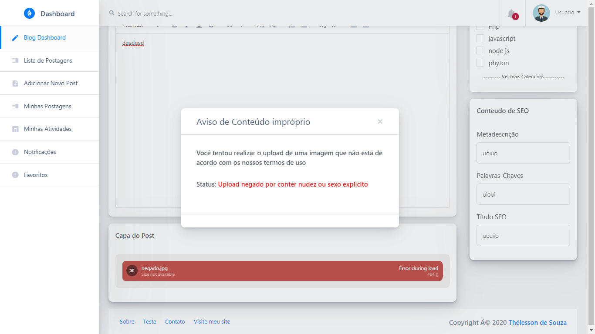

# Miniblog-Laravel-7-Google-Vision-restringe-pornografia-detector-de-faces-
Projeto open-source em andamento, 100% em português, distribuído sob a licença MIT. Miniblog simples criado com o framework Laravel. A api do Google Vision ajuda a impedir que usuários comuns façam upload de imagens pornográficas/violentas e garante que fotos de perfil de autores/usuários contenha sempre uma face humana

<p align="center">
  
</p>

## Video Demo

 * [Veja o video demonstrativo no youtube](https://youtu.be/Bk_wFjN9_aY)


## Inicio 

* Este repositório é indicado para usuários que estão iniciando no Laravel e podem ao analisar o código, identificar as redundancias nele contidas, criar novos métodos parametrizados afim de enxugar linhas inuteis, criar novas responsabilidades, criar langs para evitar textos diretos nas views, utilizar de maneira certa o blade para reduzir o numero de imports e views, etc.
~~Na verdade eu fiquei com preguiça de refatorar o código, separar tudo bonitinho em controladores, criar views blade enxutas e eliminar repetições. Funcionar, funciona mas pode ficar mehor kkkk~~
* Todo o site está habilitado para efetuar qualquer operação. Por favor, evite desconfigurar o site demo utilizando acesso superadmin para criar novos relacionamentos, cruds, tabelas, etc. Efetue as operações normais do site para criar postagens, páginas, crud de usuários, etc
* Por favor, evite excluir/ editar ou deletar qualquer um dos 3 usuários abaixo

* [Acesse a demo do projeto aqui](https://miniblog.algoritmo9.space)

* **Credenciais** 
     Acesso de admin.
     - login: admin@admin.com
     - senha: miniblog_admin
     
     Acesso de moderador.
     - login: moderador@moderador.com
     - senha: miniblog_moderador
     
     Acesso de usuári comum.
     - login: usuario@usuario.com
     - senha: miniblog_usuario
     
* **Admin** 
  Por padrão o admin possui acesso ao dashboard do voyager, onde 
  é possivel configurar o site, crud de usuários, construtor de menus, tracker, regra de acesso, etc
  para acessar o painel do voyager: https://miniblog.algoritmo9.space/admin/
  No dashboard padrão em : https://miniblog.algoritmo9.space/home , o admin consegue com maior facilidade
  as ações rotineiras do site.
  
  ** Atenção**
      O admin ao atualizar a postagem de um determinado usuário no dashboard do voyager(https://miniblog.algoritmo9.space/admin/), 
      transferirá a autoria do post para ele mesmo. Ex: Usuário comum envia uma nova postagem e o admin ao aprovar a postagem, resolve
      fazer isso através do painel do voyager. Para que o post seja mantido em nome do usuário original, o admin deverá aprovar/rejeitar/etc no dashboard (https://miniblog.algoritmo9.space/home)
  


## Instalação

 A instalação é bastante simples. Copie todo o conteúdo deste diretório e cole na raiz do seu servidor, por exemplo: /var/www/laravel ou na pasta do seu localhost.
 O segundo passo é importar o arquivo miniblog.sql que encontra-se na raiz deste diretório, para sua base de 
 dados mysql existente;
 O processo de importação do sql também é bastante fácil. 
   
 <details><summary><b>Importar usando o linux ubuntu</b></summary>

1. acesse o mysql através do seu terminal, como exemplo, o meu usuário será root:

    ```
    mysql -u root -p
    ```

  Após, insira a senha do usuário mysql
  
2. Crie um novo database, por exemplo: miniblog:

    ```
    create database miniblog;
    ```
  Após, pressione \q para sair do mysql
  
3. Importe o arquivo miniblog.sql para sua nova base criada. Copie o caminho onde você enviou o arquivo, no meu caso enviei o miniblog.sql para: /var/www/laravel 

    ```
    mysql -u root -p miniblog < /var/www/laravel/miniblog.sql
    ```
  Após, pressione \q para sair do mysql

</details>

 <details><summary><b>Importar usando o phpMyAdmin</b></summary>
  
  1.O phpMyAdmin é bastante intuitivo, basta apenas criar uma nova base de dados e clicar em importar no menu superior e fazer o upload do arquivo miniblog.sql;
  
  </details>
  
  <details><summary><b>Configurando o .Env</b></summary>

1. Altere a APP_URL pela url do seu site :

    ```
    APP_URL= SEUSITEAQUI
    ```

  
 2. Configure a conexão do seu msyql  :

    ```
    B_CONNECTION=mysql
    DB_HOST=127.0.0.1
    DB_PORT=3306
    DB_DATABASE= miniblog ou o nome da base criada
    DB_USERNAME= SEUUSUARIOAQUI
    DB_PASSWORD=SUASENHAAQUI
    ```

 
  
 3. Suas configurações de email  :

    ```
    MAIL_MAILER=smtp
    MAIL_HOST= SEUMAILHOST
    MAIL_PORT= SUAPORTA
    MAIL_USERNAME= USUARIOEMAILAQUI
    MAIL_PASSWORD=SUASENHAQUI
    MAIL_ENCRYPTION=tls
    MAIL_FROM_ADDRESS= MAILFROMAQUI
    ```

  Após, insira a senha do usuário mysql
  
  4. Quando colocar em produção, altere APP_ENV para produção  :

    ```
     APP_ENV=production
    ```

  Ao colocar o env em production, em web.php há um código para forçar todo o website para https, pois
  aparentemente há um bug no voyager que bloqueia https em alguns scripts e css, impedindo assim 
  que o tinyMce seja exibido corretamente. A opção é ou utilizar o site completemante em http ou forçar todas as rotas para https
  Caso deseja utilizar http em produção, será preciso excluir ou comentar este trecho localizado em : /routes/web.php quando o env estiver como production
   
   ```
    if (App::environment('production', 'staging')) {
    URL::forceScheme('https');
    }
   ```
   
  </details>    
  <details><summary><b>Configurando o Google Vision</b></summary>
  
 1. O primeiro passo para utilizar o Google vision é copiar a sua credencial em formato json para a raiz deste projeto. Por exemplo: 


    ```
    /var/www/laravel/meuaquivogooglejson.json
    ```
  Caso você não saiba como criar um arquivo .json, você pode conferir este tutorial aqui:
   [Configure a api do Google Vision](https://cloud.google.com/vision/docs/setup)
   
 1. Antes de prosseguir, é importante verificar se o seu php possui o módulo bcmath instalado. Caso não possua, você pode instalar no terminal linux desta forma: 


    ```
    sudo apt install php7.3-bcmath
    ```
  Este projeto foi implementado com o Php 7.3 , versões anteriores poderão possuir algumas outras pendencias 
   
   
 2. O próximo passo é ir para o painel de configuração do site: https://miniblog.algoritmo9.space/admin/settings 
 e na aba **Site** ,navegue até a opção JSON Google Vision e insira o caminho onde você inseriu o json do Google. Ex:


    ```
    /var/www/laravel/meuaquivogooglejson.json
    ```
 
 Nesta mesma aba é possivel habilitar/desabilitar as opções do Google Vision. 
 **Atenção** - Caso por o Google não consiga localizar o json informado ou por alguma outra razão não conseguir uitilizar suas credenciais, todo e qualquer upload que passe pelo Google Vision será negado e o modal de conteúdo impróprio será exibido. Para contornar esta situação basta desabilitar o Google vision nessa mesma aba, setando como não as retrições de pornografia/face, que qualquer upload será realizado normalmente. **A aba de configuração de post também possui opção de restrição Google Vision **
  
  </details> 
  
<details><summary><b>Configurando o Tracker</b></summary>
 
 1. Por padrão, o tracker que realiza o rastreio de visitantes, usuários online, logs, etc está habilitado por padrão, porém 
 em algumas situações poderá ocorrer lentidões. Em testes utilizando o vps mais básico do Lightsail e Ec2, não ocorreu lentidões mas 
 em localhost, em algumas situações ocorre queda de performace. Você pode desabilitar manualmente o tracker em : /config/tracker e alterar o status enabled/disabled


    ```
     'enabled' =>  false,
    ```
 
Ou você pode desabilitar/habilitar  alguns módulos   também nesse mesmo arquivo. Altere de acordo com a necessidade
    ```
     'log_user_agents' => true,
     'log_users' => true,
     'log_devices' => true,
     'log_languages' => true,
     etc...
    ```
     [Saiba mais sobre o funcionamento do Tracker](https://github.com/antonioribeiro/tracker)
 
 2. Geo ip - Para configurar o geopIp no tracker é importante certificar que não possua nenhum módulo geopIp php instalado. Você pode desinstalar desta forma, substituindo a versão do php pelo atual em seu servidor:


    ```
     sudo apt-get purge php5-geoip
    ```
 O tracker requer "geoip/geoip":"~1.14" ou "geoip2/geoip2":"~2.0" . Ambos já estão instalados nos pacotes composer deste projeto e configurados para evitar conflitos, porém em caso de falha, você poderá  desinstalá-los e instalar um ou outro que funcione em seu servidor
     
</details>

<details><summary><b>Erros Comuns ao realizar upload para servidor em produção</b></summary>
  
 1-  Ao fazer upload para um servidor, alguns erros podem ocorrer devido algumas configurações do seu servidor. Em alguns 
  casos, um erro de permissão pode ocorrer. Para contornar isto, certifique de habilitar a permissão para que o laravel possa escrever/ler na pasta /storage.
 
 2 - É aconselhável limpar o cache do laravel para evitar que configurações antigas do arquivo .env interfira. Na pasta raiz do projeto em seu servidor, por exemplo /var/www/laravel execute 
     ```
      php artisan cache:clear
      php artisan config:clear
      php artisan route:clear
    ```
 3 - Caso ocorra erro eventual de imagens não serem exibidas corretamente, pode ser necessário deletar o atalho ou pasta storage em /public e realizar o seguinte comando:
   
    ```php artisan storage:link
    ```
</details> 
<details><summary><b>Pasta temporária</b></summary>
  Ao utilizar o Google Vision, as imagens são enviadas temporáriamente para o servidor através do filePond. As imagens temporárias
  são armazenadas no seguinte diretório:
  
    ```/storage/app/public/tempupload
    ```
  Durante o processo de validação da imagem através do Google Vision, toda imagem aprovada primeiramente é enviada para a pasta /tempupload e caso o usuário mantenha a opção de cadastrar postagem/avatar, a imagem é movida para a sua devida pasta, caso o ousuário
  desista ou ocorra alguma falha, a imagem é automaticamente deletada do servidor.
  Nesta pasta, existe uma imagem ca.jpg que é sempre chamada para causar um erro intencional no filePond quando o Google não autoriza o upload. Por padrão o upload através do Google Vision/Filepond está configurado para permitir jpg e png mas pode ser otimizado para aceitar qualquer formato de imagem, para isto será necessário alterar no código
  </details>


## Notificações e pasta temporária

<details><summary><b>Notificações</b></summary>
  As notificações podem ser configuradas para ser chamada em qualquer parte do código. Para que seja enviado por email é preciso que no arquivo .env as credenciais de email esteja configuradas corretamente, caso contrário ocorrerá erro quando em produção. 
  Para enviar notificações apenas dentro do laravel, você pode desabilitar o método toMail na classe de notificações  ou remover as credenciais de email. O método abaixo pode ser chamado onde julgar necessário para enviar novas notificações:
  
    ```
      public function notificacoesBase($subject,$greeting,$body,$thanks,$usuarioId){
        $user9 = \App\User::find($usuarioId);
        $details = [
            'subject' =>$subject,
            'greeting' => $greeting,
            'body' => $body,
            'thanks' => $thanks,
    ];
    return $user9->notify(new \App\Notifications\TarefaCompleta($details));
    }
    ```
  Basta apenas chamar o método  notificacoesBase() antes de retornar. Caso este método esteja na mesma classe utilize o self:: ou 
  importe a classe onde o método está hospedado. 
  Exemplo de chamada do método:
  
     ```
        $sub ="Miniblog - Nova alteração no perfil";
        $gree = "Nova Alteração no Perfil";
        $textoMg = "Nosso sistema confirmou a alteração do seu nome de usuário, email e avatar no dia de {$hojeFormatado} através do ip:{$ip}";
        self::notificacoesBase($sub,$gree,$textoMg,':)',Auth()->user()->id);
    ```
 
                                        
  </details>
  

<details><summary><b>Pasta temporária</b></summary>
  Ao utilizar o Google Vision, as imagens são enviadas temporáriamente para o servidor através do filePond. As imagens temporárias
  são armazenadas no seguinte diretório:
  
    ```/storage/app/public/tempupload
    ```
  Durante o processo de validação da imagem através do Google Vision, toda imagem aprovada primeiramente é enviada para a pasta /tempupload e caso o usuário mantenha a opção de cadastrar postagem/avatar, a imagem é movida para a sua devida pasta, caso o ousuário
  desista ou ocorra alguma falha, a imagem é automaticamente deletada do servidor.
  Nesta pasta, existe uma imagem ca.jpg que é sempre chamada para causar um erro intencional no filePond quando o Google não autoriza o upload. Por padrão o upload através do Google Vision/Filepond está configurado para permitir jpg e png mas pode ser otimizado para aceitar qualquer formato de imagem, para isto será necessário alterar no código
  </details>

## Créditos

 * Backend: Thélesson de Souza 
    ** Contato profisional :  [Fale comigo no Linkedin](https://www.linkedin.com/in/thelesson/) 
 * Frontend :  Start Bootstrap 
 * Tema utilizado : [Clean BLog ](https://startbootstrap.com/themes/clean-blog/)
 * Pacotes:
    ** Voyager - https://github.com/the-control-group/voyager
    ** Laravel Stats Tracker - https://github.com/antonioribeiro/tracker
    
## Características

   * Regras de acesso
   * Criação de páginas
   * Restrição postagens 
   * Habilita/Desabilita determinada postagens para usuários membros(logados)
       * Por padrão usuários comuns podem enviar até 02 postagens para aprovação por vez (Número de envio pode ser configurado pelo admin)
       * Impedir que usuários removam ou editem postagens aprovadas ou rejeitadas(Aprovação automática pode ser configurada pelo admin)
Impedir que usuário comum exclua postagem enviada para aprovação(Admin pode configurar e permitir o controle completo do post para o usuário, caso necessário ou desejar)
       * Aviso de conteúdo impróprio - Admins podem ativar avisos de restrição no site, substituindo imagens de conteúdo sexual/violento, por uma imagem de aviso, orientando aos usuários realizarem login para ver publicação
       * Impedir que usuários comus façam uploads de imagens com conteúdo sexual/violento  antes de enviar a postagem para aprovação
   * Construtor de menu arrasta e solta através do dashboard do voyager
   * Gerenciador de banco de dados - Permite criar/deletar/edtar tabelas sem necessidade de editar o código, através do dashboard Voyager
   * Gerenciador de midia 
   * Rastreio de atividades de usuários
       * Usuário Comum - Exibe seu registro de atividades no sistema
       * Admins/outros - Exibe o registro de atividades de todos usuários no sistema
   * Logs  do sistema
       * Tracker Geoips
       * Tracker de dominios
       * Tracker de log geral
       * Tracker de erros
       * Tracker de Sql queries
       * Tracker Paths
       * Tracker Dispositivos
       * Tracker de rotas
       * Tracker de sessões
   * Registro de Visitantes
       * Exibe a lista de usuários e robôs ao site, exibindo ip, localização, ações no site, etc
   * Widgets
       * Sessões do usuário  - Exibe ao usuário logado sua sessão atual e locais onde se conectou, exibindo ip, tipo dispositivo,plataforma, etc
       * Gráfico de crescimento - Exibe aos admins e moderadores um gráfico que mostra o comparativo entre usuarios cadastrados nos ultimos 30 dias VS Usuarios Totais nos ultimos 30 dias
       * Gráfico de dispositivos - Exibe aos admins e moderadores um gráfico de porcentagem de dispositivos mais utilizados para acessar o sistema 
       * Widget de notificação - Permite ao admins ou moderadores(caso esteja habilitado para enviar notificações), enviar notificações/email para determinado usuário ou para todos de uma só vez
       * Widget Mensagens de Contato - Exibe ao admins ou moderadores(caso esteja habilitado para enviar notificações), a leitura e exclusão rápida das mensagens de contato  recebidas pelo sistema
       * Lista de Favoritos - Exibe a lista das mais recentes postagens favoritadas
       * Cards informativos - Exibe aos admins e moderadores cards contendo sobre total de páginas, postagens, total de usuários, total de usuários nos ultimos 30 dias, usuários online, etc
       * Cards informativos - Exibe ao usuário comum a quantidade de posts que ele enviou para aprovação, postagens aprovadas, rejeitadas, pendentes e postagens que ele favoritou
       * Habilitar/Negar uploads com nudez/sexo explicito
       * Habilitar/negar uploads de avatares de perfil que não contenha face humana
       * Envio de Notificações aos usuários do sistema(todos, por id, por email)
       * Favoritar postagens
       * Impedir/habilitar que usuário excluido pelo admin/moderador cadastre-se novamente com o mesmo email
       * Notificações por email habilitado
       * Mensagens de contato
   * Crud Builder - Permite criar novos cruds e relacionamentos, através do dashboard Voyager
   * 100%  em português brasileiro(Dashboard Usuário e Dashboard Voyager)
   * Integração de comentários com o disqus
   
   miniblog-github\vendor\composer\composer\doc\fixtures\repo-composer-with-providers\p\barbaz$923363b3c22e73abb2e3fd891c8156dd4d0821a97fd3e428bc910833e3e46dbe.json
 
